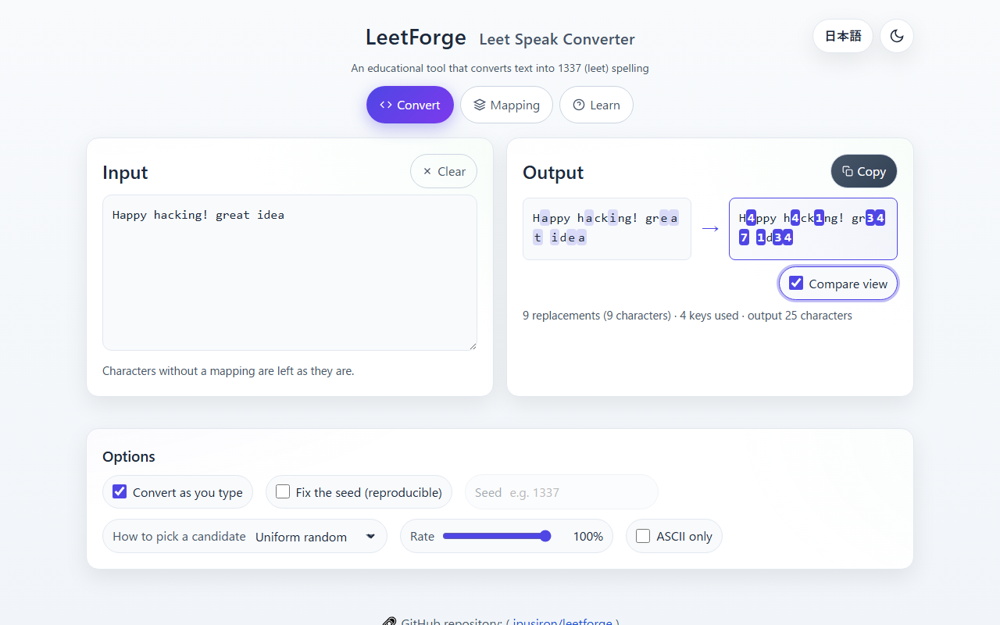
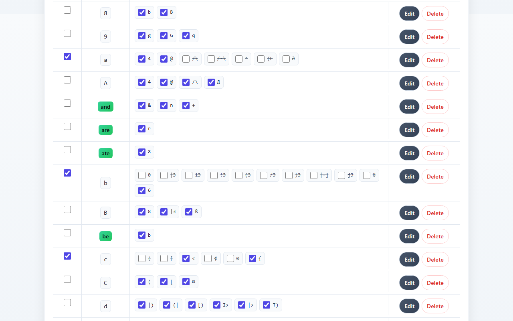
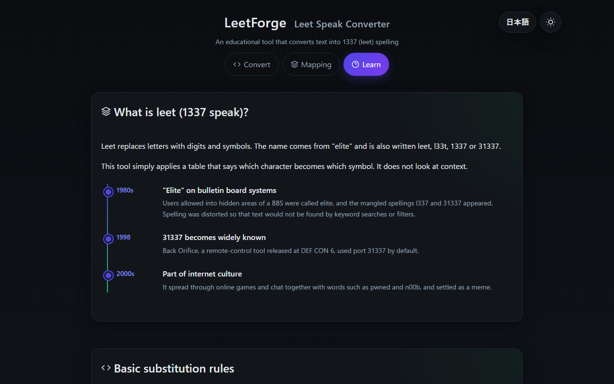

English · [日本語](README.md)

# LeetForge - Leet Speak Converter


[](https://ipusiron.github.io/leetforge/)

**Day079 - 100 Security Tools with Generative AI**

LeetForge is an educational tool that converts text into 1337 (leet) spelling. A mapping table decides which character becomes which symbol, and when a key has several candidates the tool picks one either at random (reproducible with a seed) or in turn.

Presets identical to the substitution tables used by hashcat, John the Ripper and cupp are included, so you can see for yourself that replacing letters with leet symbols does not make a password stronger. The name "forge" means both "to craft" and "to counterfeit".

---

## 🌐 Demo

👉 **[https://ipusiron.github.io/leetforge/](https://ipusiron.github.io/leetforge/)**

Runs entirely in your browser. Nothing is sent anywhere.

---

## 📸 Screenshots


> *Convert tab: the Basic preset with the compare view pairing each replaced segment*


> *Mapping tab: the mapping after applying the preset identical to hashcat's leetspeak.rule*


> *Learn tab (dark mode): where leet comes from, with a timeline*

---

## ✨ Features

- Converts input to leet spelling in a single pass over the text according to the mapping (up to 50,000 characters)
- Keys with several candidates are resolved by uniform random choice (reproducible with a seed) or round robin
- Convert-as-you-type mode, plus a manual mode that gives a different result on every click
- Options for the conversion rate (0–100%) and ASCII only (skip non-ASCII candidates)
- A compare view that pairs each replaced segment before and after conversion and counts the replacements
- Checks whether the current output can be produced by the default substitution tables of hashcat, John the Ripper and cupp, and shows how many outputs the mapping can produce (in bits)
- Hands the output to WeirdString Inspector (Day023) to inspect look-alike characters
- The mapping can be toggled per key (a character or a word) and per candidate, and keys can be added, edited and deleted
- 10 presets: Basic, Standard, Advanced, Elite, Words, Combo, Reverse, and the substitution tables of hashcat, John the Ripper and cupp
- JSON export and import of the mapping (imports are validated structurally)
- Japanese and English UI (`?lang=ja` / `?lang=en`, or the button in the header) and light / dark themes
- Works even when browser storage is unavailable, and tells you that settings will not be saved

---

## 📖 Usage

1. Type text into the input box on the Convert tab. By default it is converted as you type and the result appears in the output box
2. Turn on "Compare view" to see before and after side by side, with each replaced segment highlighted as a pair
3. Choose how candidates are picked under "How to pick a candidate". Turn on "Fix the seed" and enter a number to get the same result from the same input
4. Lower the "Rate" to replace only some characters. Turn on "ASCII only" to avoid symbols that passwords and user names cannot contain
5. On the Mapping tab, choose a preset and press "Apply" to switch keys and candidates on and off at once. The confirmation dialog shows how many keys will be turned on and off
6. Toggle individual candidates with the checkbox next to each one, or whole keys with the checkbox on the left. "Edit" changes the candidates; "Add key" adds a new character or word
7. "Export" saves the mapping as JSON and "Import" loads one. "Reset" returns to the initial state (the Basic preset)
8. "Check against cracking-tool rules" below the output shows whether the default tables of hashcat, John the Ripper and cupp can produce the current output, and how many outputs this mapping can produce. "Inspect with WeirdString Inspector" hands the output to WeirdString Inspector (Day023) in a new tab
9. The Learn tab explains where leet comes from, the basic substitutions, where it is used and the caveats

---

## 📐 Screens

| Tab | Contents |
|---|---|
| Convert | Input, output, compare view, replacement count, options (as you type, fixed seed, picking method, rate, ASCII only), check against cracking-tool rules |
| Mapping | Mapping table (key, candidates, on/off), add and edit keys, presets, export and import, reset |
| Learn | Origin and timeline of leet, basic substitution rules, where it is used, caveats and good practice |

The buttons at the top right switch the language (Japanese / English) and the theme (light / dark).

---

## 🔬 Technical notes

### How conversion works

Conversion is done by `convert()` in `js/leet-core.js`. It scans the input once from the start and, at each position, tries the mapping in this order.

1. Word keys (two or more characters): longest first, case-insensitive, matched as whole words delimited by non-alphanumeric characters (letters, digits and `_` count as word characters)
2. Single-character keys: case-sensitive

A replaced string is never touched again. Even if a candidate contains another key (such as the `h` in `f`→`ph`), it is not replaced a second time. The result is returned as an array of segments, and the output, the compare view and the counts are all built from those segments.

### How a candidate is picked

- Uniform random: a 32-bit hash of the seed, the position and the key, reduced modulo the number of candidates. The same input with the same seed gives the same result, and appending characters never changes the candidates chosen for earlier characters
- Round robin: candidates are used in turn, per key, within one conversion
- When "Fix the seed" is off, convert-as-you-type keeps the seed chosen when the page was opened. The manual "Convert" button draws a new seed on every click
- The rate replaces a position only when its per-position hash is below the rate. Lowering the rate removes positions; it never changes which other positions are replaced

### Presets

The catalog has 74 keys (26 lowercase letters, 26 uppercase letters, 10 digits and 12 words), and a preset decides which keys and which candidates are on. Three of the 10 presets copy the substitution tables that dictionary-attack tools ship with.

| Preset | What it is | Substitutions |
|---|---|---|
| `basic` | Seven one-to-one substitutions | `a→4 e→3 i→1 o→0 s→5 t→7 l→1` |
| `standard` | Twelve common letters with one or two candidates each | `a→4/@ b→8 c→( e→3 g→9 h→# i→1/! l→1 o→0 s→5/$ t→7 z→2` |
| `advanced` | All 26 lowercase letters with every ASCII candidate | As in the catalog |
| `elite` | All 52 lowercase and uppercase letters with every candidate, including non-ASCII | As in the catalog |
| `words` | Twelve English words shortened | As in the catalog (and→&, for→4, great→gr8, …) |
| `combo` | The seven Basic letters plus six words | `a→4 e→3 i→1 o→0 s→5 t→7 l→1 and→& for→4 to→2 you→u are→r great→gr8` |
| `reverse` | Digits 0–9 back to letters | As in the catalog (not unique: 1→i/I/l/L/\|) |
| `hashcat` | Identical to hashcat's `rules/leetspeak.rule` | `a→4/@ b→6 c→</{ e→3 g→9 i→1/! o→0 q→9 s→5/$ t→7/+ x→%` |
| `john` | Identical to `[List.External:Leet]` in John the Ripper's `john.conf` | `a→4/@ b→8 e→3 g→9 i→1/! l→1 o→0 s→$/5 t→7` |
| `cupp` | Identical to `[leet]` in cupp's `cupp.cfg` | `a→4 i→1 e→3 t→7 o→0 s→5 g→9 z→2` |

### Check against cracking-tool rules

The three tools have similar tables but use them differently, so whether they can produce a given output is checked separately (`coverage()`).

| Tool | How the table is used | Check |
|---|---|---|
| hashcat `rules/leetspeak.rule` | Each rule applies one substitution to every occurrence (16 rules such as `sa4`). One line, `sa@sc<se3si1so0ss$`, applies six at once | Does any of the 17 lines turn the input into the output? |
| John the Ripper `[List.External:Leet]` | Runs through every combination of "original / each candidate" for the table letters from the start of the word. At most 10 letters are varied, and it stops once the combinations reach 4,000 | Are all substitutions at varied positions, with candidates from the table? |
| cupp `[leet]` | Applies the whole table at once (one result) | Does the output equal that result? |

For example, turning `password` into `p455w0rd` with the Basic preset gives × for hashcat (a rule substitutes only one kind of character), ○ for John the Ripper (within the 54 combinations over the first four letters) and ○ for cupp (identical to applying the whole table). Enabling only `a→@`, `s→$` and `o→0` to get `p@$$w0rd` gives ○ for hashcat through the multi line.

"Outputs this mapping can produce" is the product of (1 + number of candidates) over the replaceable positions, also shown as a power of two. It is the extra work for an attacker who knows the table. The substitutions used are listed with the tables that contain them (`e→ə`, for example, is in none).

### Known answers

The tests recompute these examples with the core module.

- Basic preset: `Happy hacking!` → `H4ppy h4ck1ng!`, `hello world` → `h3110 w0r1d`, `company2024` → `c0mp4ny2024`
- Combo: `great idea` → `gr8 1d34`
- Words: `you're great, mate` → `u're gr8, m8`
- cupp: `password` → `p455w0rd`

### Data model

The mapping is saved and exchanged as JSON. `alts` is the list of candidates, each with its own on/off flag.

```json
{
  "version": 1,
  "map": {
    "a": {
      "enabled": true,
      "alts": [
        { "value": "4", "enabled": true },
        { "value": "@", "enabled": false }
      ]
    },
    "great": {
      "enabled": true,
      "alts": [
        { "value": "gr8", "enabled": true }
      ]
    }
  }
}
```

Import checks the structure of `map`, the characters of each key (no spaces or control characters, up to 20 characters) and the number and length of candidates, and skips entries that fail. Candidate values are accepted as they are (strings such as `data:` are not rewritten).

### Limits

| Item | Value | Meaning |
|---|---|---|
| `LIMITS.text` | 50,000 | Input length (UTF-16 units) |
| `LIMITS.keyLength` | 20 | Key length (code points) |
| `LIMITS.keys` | 200 | Number of keys in the mapping |
| `LIMITS.altLength` | 20 | Candidate length (code points) |
| `LIMITS.altsPerKey` | 32 | Candidates per key |
| `LIMITS.importBytes` | 1,048,576 | Size of an imported JSON file (1 MB) |

---

## 🎯 Use cases

- Education: in an IT class, use it as the simplest substitution cipher to see how a table relates to the output. The preset tables and the rate slider make it tangible that "if the rules are public, the candidates can be counted even though the text looks different"
- Education: in English or media classes, read and write the leet and 31337 of internet culture. The timeline on the Learn tab only states what could be confirmed from primary sources
- Learning security: check why "p@ssw0rd" looks strong and why it is nevertheless covered by dictionary-attack rules, using the hashcat, John and cupp presets
- Work (web operations): mass-produce test inputs for word filters (evasions such as `v1agra`) while varying the rate
- Work (community management): enumerate leet variants of a name to spot look-alike user names and impersonation candidates
- Everyday life: explain to family or colleagues, with the attack-rule tables on the Learn tab, why changing a few letters to digits is not a safety measure
- Hobbies and creative work: make user names for games and social media, stream captions, T-shirt and sticker lettering. The Elite preset's non-ASCII symbols are fun to play with
- Hobbies and creative work: write puzzle and escape-room clues, lines for a hacker character in a tabletop RPG, or read the 1337 spellings in CTF write-ups
- Research: compare the hashcat, John and cupp substitution tables on one screen. Save your own mapping as JSON and diff it
- With other tools: hand the output to [WeirdString Inspector (Day023)](https://ipusiron.github.io/weirdstring-inspector/) with the "Inspect with WeirdString Inspector" button and the non-ASCII candidates are flagged as look-alike characters. Paste it into [Password Checker (Day001)](https://ipusiron.github.io/password-checker/) to see how little symbol substitution adds compared with length
- Limits: the conversion is mechanical and ignores context. Decoding is not unique. The tool does not rate strength

---

## 🔒 Security

- There is no network communication. Conversion, storage and import all happen inside the browser
- The mapping and options are kept in localStorage. Where storage is unavailable the tool keeps working in memory and says so
- Input is converted without being altered, and the output is shown as the value of a textarea. The compare view is built with DOM APIs; innerHTML is not used
- A CSP is set in a meta element of `index.html` (`default-src 'self'`, `script-src 'self'`, `style-src 'self'`, `connect-src 'none'`, `object-src 'none'`, `base-uri 'none'`), with no inline scripts or style attributes. The referrer policy is `no-referrer`
- X-Frame-Options and CSP `frame-ancestors`, which protect against clickjacking, only work as HTTP headers, so they are not set on GitHub Pages. They are not written in meta elements either, because they have no effect there
- Leet does not make a password stronger. hashcat's `rules/leetspeak.rule`, John the Ripper's `[List.External:Leet]` and cupp's `[leet]` build the same substitutions as this tool's presets into dictionary attacks. NIST SP 800-63B-4 (2025) tells services not to impose composition rules such as mixing character types. In a 2016 study (Ur et al., CHI’16) participants rated p@ssw0rd stronger than pAsswOrd, yet pAsswOrd needed about 4,000 times more guesses

---

## ⚠️ Caveats

- The conversion applies the table mechanically and ignores context. Proper nouns and URLs are converted too
- Single-character keys are case-sensitive and word keys are not. Word replacements are lowercase, so `GREAT` also becomes `gr8`
- Several keys share a symbol (`1` for i and l, `7` for t and l, `|` for i, l and t), so the Reverse preset can only list candidates
- Output from presets with non-ASCII candidates (such as Elite) may not be accepted in passwords or user names. Turn on "ASCII only"
- Screen readers cannot read symbols as letters. If you publish text in leet, provide the plain text as well
- This tool exists for play and for learning how the mechanism works. Using it to deceive people is not encouraged

---

## ❓ FAQ

**Q. The same input gives a different result every time I convert manually.**
A. The manual "Convert" button draws a new seed on every click. For a repeatable result, turn on "Fix the seed" and enter a number. Convert-as-you-type keeps the same seed while the page is open.

**Q. I typed HELLO with the Basic preset and nothing changed.**
A. The Basic preset only has lowercase keys. Use the Elite preset or turn on the uppercase keys on the Mapping tab.

**Q. Can I load a JSON file exported by an older version?**
A. Yes. The old format, where candidates were plain strings, is converted to the new format on import.

**Q. Does changing the rate reshuffle which characters are replaced?**
A. No. Whether a position is replaced is decided by a per-position hash, so raising the rate only adds positions; positions that were already replaced stay replaced.

**Q. How do I switch to Japanese?**
A. Press "日本語" at the top right or add `?lang=ja` to the URL. The choice is remembered.

---

## 🔗 References

- [Leet - Wikipedia (English)](https://en.wikipedia.org/wiki/Leet) (section "Table of leet-speak substitutes for normal letters")
- [Leet - Wikipedia (Japanese)](https://ja.wikipedia.org/wiki/Leet)
- [hashcat rules/leetspeak.rule](https://github.com/hashcat/hashcat/blob/master/rules/leetspeak.rule), [rule-based attack](https://hashcat.net/wiki/doku.php?id=rule_based_attack)
- [John the Ripper run/john.conf](https://github.com/openwall/john/blob/bleeding-jumbo/run/john.conf) (`[List.External:Leet]`)
- [cupp (Mebus/cupp)](https://github.com/Mebus/cupp) (`[leet]` in `cupp.cfg`)
- [NIST SP 800-63B-4 Digital Identity Guidelines: Authentication and Authenticator Management](https://pages.nist.gov/800-63-4/sp800-63b.html) (3.1.1.2 Password Verifiers, Appendix A)
- Blase Ur et al., "Do Users' Perceptions of Password Security Match Reality?", CHI 2016 ([PDF](http://users.ece.cmu.edu/~lbauer/papers/2016/chi2016-pwd-perceptions.pdf))
- [The Jargon File: elite](http://www.catb.org/jargon/html/E/elite.html) (BBSes in the 1980s and 31337)
- [BBC h2g2: An Explanation of l33t Speak (2002)](https://h2g2.com/entry/A787917)
- [Hacking Lab: Forging Dictionary Files (Japanese-language book)](https://akademeia.info/?page_id=22508) (5.3.3 "Enabling leet mode", Appendix B "Leet substitution table")

---

## 📁 Directory structure

```
leetforge/
├── .github/                      # GitHub Actions settings
│   └── workflows/                # Workflows
│       └── test.yml              # Runs npm test on push and pull_request
├── assets/                       # Images for the README
│   ├── en/                       # English screens
│   │   ├── screenshot.png        # Convert (English)
│   │   ├── screenshot2.png       # Mapping (English)
│   │   └── screenshot3.png       # Learn (English, dark)
│   ├── screenshot.png            # Convert (compare view)
│   ├── screenshot2.png           # Mapping (hashcat preset)
│   └── screenshot3.png           # Learn (dark)
├── js/                           # Scripts that do not depend on the screen
│   ├── i18n.js                   # Language selection and static text replacement
│   ├── leet-core.js              # Core (mapping, presets, conversion, validation)
│   └── messages.js               # Japanese and English dictionaries
├── test/                         # node:test tests (no dependencies)
│   ├── contrast.test.js          # Color contrast ratios
│   ├── core.test.js              # Core behaviour and known answers
│   ├── format.test.js            # Line length, line endings, purity of the core, where text lives
│   ├── html.test.js              # Static checks of index.html (CSP, ids, ARIA)
│   ├── i18n.test.js              # Dictionaries and data-i18n coverage
│   ├── load.js                   # Loader helper for tests
│   └── readme.test.js            # README examples, tables, images and tree
├── .gitignore                    # Files ignored by Git
├── .nojekyll                     # Disables Jekyll on GitHub Pages
├── CLAUDE.md                     # Structure notes for Claude Code
├── index.html                    # The three-tab page
├── LICENSE                       # MIT License
├── package.json                  # Defines npm test (no dependencies)
├── README.en.md                  # This document
├── README.md                     # Japanese README
├── script.js                     # Screen logic (DOM, storage, dialogs)
└── style.css                     # Styles (light / dark, responsive)
```

---

## 🧪 Tests

```bash
npm test
```

Runs on Node.js 22 or later with no dependencies. GitHub Actions runs it on every push and pull request.

| File | What it checks |
|---|---|
| `test/core.test.js` | Known answers, word boundaries, no chained replacement, stable output while typing, no misses in an exhaustive search, preset tables matching the primary sources, import validation |
| `test/readme.test.js` | README examples, preset tables, limits and counts recomputed from the core; image existence and captions; every file in the directory tree; heading correspondence between the two READMEs; wording rules |
| `test/html.test.js` | CSP, referrer, favicon, noscript, absence of inline handlers and style attributes, ids, ARIA, tabindex |
| `test/contrast.test.js` | Text and background contrast of 4.5:1 or better in light and dark, and agreement of the three variable definitions |
| `test/i18n.test.js` | Matching dictionary keys, no Japanese left in English strings, `data-i18n` coverage, language selection |
| `test/format.test.js` | No minified files, LF line endings, no DOM access in the core, no Japanese string literals in the screen script |

---

## 💻 Requirements

- A modern browser (Chromium-based, Firefox, Safari). Verified with Chromium 145, Microsoft Edge and Firefox 140
- Works when opened from `file://`. To serve locally, use `python -m http.server 8000` or similar
- Screen width of 320px or more. On phones the header buttons move above the title

---

## 📄 License

MIT License – see [LICENSE](LICENSE) for details.

---

## 🛠️ About this tool

This tool was developed as part of the "100 Security Tools with Generative AI" project.
In this project, a variety of security-related tools are created and published over 100 days with the help of AI.

For details and the other tools, see the page below.

🔗 [https://akademeia.info/?page_id=42163](https://akademeia.info/?page_id=42163)
