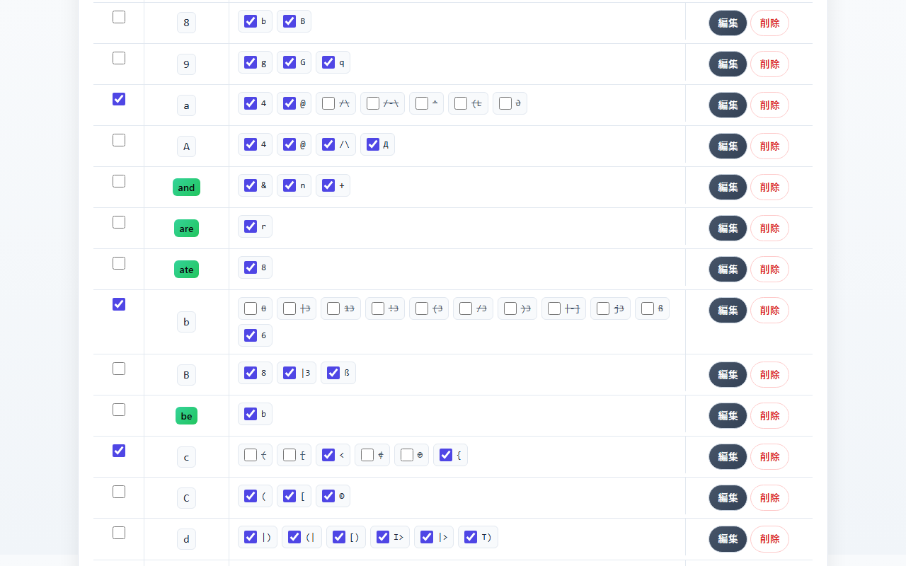
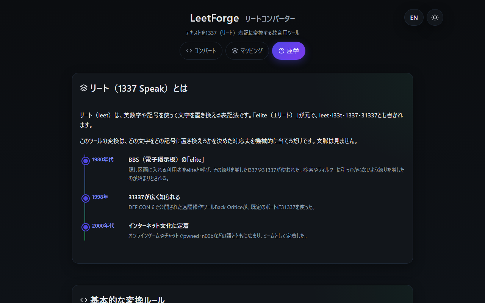

<!--
---
id: day079
slug: leetforge

title: "LeetForge"

subtitle_ja: "リートコンバーター"
subtitle_en: "Leet Speak Converter"

description_ja: "テキストを1337（リート）表記に変換する教育用ツール。対応表はキーと候補の単位で編集でき、hashcat・John the Ripper・cuppの置換表と同じプリセットで「リートはパスワードを強くしない」ことを確かめられます。日英対応。"
description_en: "Educational tool that converts text into 1337 (leet) spelling. Edit the mapping per key and candidate, and apply presets identical to the hashcat, John the Ripper and cupp substitution tables to see why leet does not strengthen passwords. Japanese and English UI."

category_ja:
  - テキスト変換
  - 符号化
category_en:
  - Text Conversion
  - Encoding

difficulty: 1

tags:
  - leet
  - converter
  - obfuscation
  - education
  - password
  - javascript

repo_url: "https://github.com/ipusiron/leetforge"
demo_url: "https://ipusiron.github.io/leetforge/"

hub: true
---
-->

[English](README.en.md) · 日本語

# LeetForge - リートコンバーター


[](https://ipusiron.github.io/leetforge/)

**Day079 - 生成AIで作るセキュリティツール100**

LeetForgeは、テキストを1337（リート）表記に変換する教育用ツールです。どの文字をどの記号に置き換えるかを対応表で決め、候補が複数あるときはシードで再現できる乱数か順番で選びます。

hashcat・John the Ripper・cuppが使う置換表と同じプリセットを用意しているので、「リートに置き換えてもパスワードは強くならない」ことを自分の目で確かめられます。名前の「forge」には「鍛える」と「偽造する」の両方の意味を込めています。

---

## 🌐 デモページ

👉 **[https://ipusiron.github.io/leetforge/](https://ipusiron.github.io/leetforge/)**

ブラウザーで直接お試しいただけます。外部へ送信するデータはありません。

---

## 📸 スクリーンショット


> *コンバートタブ。基本プリセットで変換し、比較ビューで置換した箇所を対にして表示*


> *マッピングタブ。hashcatのleetspeak.ruleと同じプリセットを当てた対応表*


> *座学タブ（ダークモード）。リートの由来と年表*


> *攻撃者のルールとの照合。cuppのプリセットで変換したpasswordを3つのツールが作れるか*

---

## ✨ 機能

- 入力した文字列を、対応表のとおりに1パスでリート表記に変換する（最大50,000文字）
- 候補が複数あるキーは、一様ランダム（シードで再現できる）かラウンドロビンで選ぶ
- 入力しながら変換するリアルタイムモードと、押すたびに別の結果が出る手動モード
- 変換率（0〜100%）とASCIIのみ（非ASCIIの候補を使わない）のオプション
- 比較ビューで、変換前と変換後の置換した箇所を対にして表示し、置換の件数を出す
- いまの出力をhashcat・John the Ripper・cuppの既定の置換表で作れるかを照合し、対応表から作れる出力の数（ビット換算）を示す
- 出力をWeirdString Inspector（Day023）へ渡して、見た目の似た文字を検査する
- 対応表はキー（1文字または単語）と候補の単位で有効・無効を切り替え、追加・編集・削除ができる
- プリセット10種類（基本・標準・上級・エリート・単語変換・コンボ・逆変換と、hashcat・John the Ripper・cuppの置換表）
- 対応表のJSONエクスポートとインポート（構造を検証して読み込む）
- 日本語と英語の画面（`?lang=ja`／`?lang=en`、ボタンで切り替え）、ライトとダークの配色
- 保存領域（localStorage）が使えない環境でも動き、保存できないことを通知する

---

## 📖 使い方

1. コンバートタブの入力欄に文字列を入れます。既定ではリアルタイムに変換され、出力欄に結果が出ます
2. 「比較ビュー」をオンにすると、変換前と変換後が並び、置換した箇所が対になって光ります
3. 候補が複数あるキーの選び方は「複数候補の選択方式」で変えます。「シード固定」をオンにして数を入れると、同じ入力から同じ結果が得られます
4. 「変換率」を下げると一部の文字だけを置き換えます。「ASCIIのみ」をオンにすると、パスワードやユーザー名に使えない記号を避けられます
5. マッピングタブでプリセットを選んで「適用」を押すと、キーと候補の有効・無効がまとめて切り替わります。確認ダイアログに、有効になるキーと無効になるキーの数が出ます
6. 候補の横のチェックで候補ごとに、行の左のチェックでキーごとに切り替えられます。「編集」で候補を書き換え、「キーを追加」で新しい文字や単語を足せます
7. 「エクスポート」で対応表をJSONに保存し、「インポート」で読み込めます。「初期化」で初回の状態（基本プリセット）に戻ります
8. 出力の下の「攻撃者のルールとの照合」で、いまの出力をhashcat・John the Ripper・cuppの既定の表が作れるか、この対応表から何通りの出力が作れるかを見られます。「WeirdString Inspectorで検査」を押すと、出力を別タブのWeirdString Inspector（Day023）に渡します
9. 座学タブで、リートの由来・基本的な置換・活用場面・注意点を読めます

---

## 📐 画面構成

| タブ | 内容 |
|---|---|
| コンバート | 入力欄・出力欄・比較ビュー・置換の件数・オプション（リアルタイム、シード固定、選択方式、変換率、ASCIIのみ）・攻撃者のルールとの照合 |
| マッピング | 対応表（キー・候補・有効）、キーの追加と編集、プリセット、エクスポートとインポート、初期化 |
| 座学 | リートの由来と年表、基本的な置換ルール、活用場面、注意点とベストプラクティス |

ヘッダー右上のボタンで、言語（日本語／英語）と配色（ライト／ダーク）を切り替えます。

---

## 🔬 技術的な説明

### 変換の仕組み

変換は`js/leet-core.js`の`convert()`が行います。入力を先頭から1回だけ走査し、各位置で次の順に対応表を当てます。

1. 単語のキー（2文字以上）。長い順に試し、大文字小文字を区別せず、英数字と`_`で区切られた語の単位で当てる
2. 1文字のキー。大文字小文字を区別する

置換した文字列は二度と触りません。候補に別のキーの文字が含まれていても（`f`→`ph`の`h`など）、連鎖して置き換わることはありません。結果は「区間」の配列として返り、画面の出力・比較ビュー・件数はすべてこの区間から作ります。

### 候補の選び方

- 一様ランダムは、シードと位置とキーから32ビットのハッシュを作り、候補の数で割った余りで選ぶ。同じ入力と同じシードなら同じ結果になり、末尾に文字を足しても前の文字の候補は変わらない
- ラウンドロビンは、1回の変換の中でキーごとに候補を順番に回す
- 「シード固定」をオフにしたリアルタイム変換では、ページを開いたときに決めたシードを使い続ける。手動の「変換を実行」は押すたびにシードを引き直す
- 変換率は、位置ごとのハッシュが率を下回るときだけ置き換える。率を上げると置き換わる位置が増えるだけで、すでに置き換わっていた位置は変わらない

### プリセット

目録は74キー（小文字26・大文字26・数字10・単語12）で、プリセットはキーと候補の両方の有効・無効を決めます。10種類のうち3つは、辞書攻撃ツールが同梱する置換表をそのまま写したものです。

| プリセット | 内容 | 置換 |
|---|---|---|
| `basic` | 7文字の単一対応 | `a→4 e→3 i→1 o→0 s→5 t→7 l→1` |
| `standard` | よく見る12文字、候補は1〜2個 | `a→4/@ b→8 c→( e→3 g→9 h→# i→1/! l→1 o→0 s→5/$ t→7 z→2` |
| `advanced` | 小文字26文字。ASCIIの候補をすべて使う | 目録のとおり |
| `elite` | 小文字と大文字52文字。非ASCIIを含む候補をすべて使う | 目録のとおり |
| `words` | 英単語12語を短く | 目録のとおり（and→&、for→4、great→gr8など） |
| `combo` | 基本の7文字に単語6語を足す | `a→4 e→3 i→1 o→0 s→5 t→7 l→1 and→& for→4 to→2 you→u are→r great→gr8` |
| `reverse` | 数字0〜9を文字に戻す | 目録のとおり（1→i/I/l/L/\|のように一意には戻らない） |
| `hashcat` | hashcatの`rules/leetspeak.rule`と同じ | `a→4/@ b→6 c→</{ e→3 g→9 i→1/! o→0 q→9 s→5/$ t→7/+ x→%` |
| `john` | John the Ripperの`john.conf`にある`[List.External:Leet]`と同じ | `a→4/@ b→8 e→3 g→9 i→1/! l→1 o→0 s→$/5 t→7` |
| `cupp` | cuppの`cupp.cfg`にある`[leet]`と同じ | `a→4 i→1 e→3 t→7 o→0 s→5 g→9 z→2` |

### 攻撃者のルールとの照合

3つのツールは置換表が似ていても使い方が違うので、同じ出力を作れるかは別に調べます（`coverage()`）。

| ツール | 表の使い方 | 判定 |
|---|---|---|
| hashcat `rules/leetspeak.rule` | 1行につき1種類の置換を文字列の全部に当てる（`sa4`など16行）。`sa@sc<se3si1so0ss$`の1行だけ6種類を同時に当てる | 17行のどれかで入力が出力になるか |
| John the Ripper `[List.External:Leet]` | 表にある文字を先頭から順に「元のまま／各候補」で総当たりする。回す文字は10個まで、組み合わせが4,000以上になった時点で打ち切り | 置換がすべて回す位置にあり、候補が表にあるか |
| cupp `[leet]` | 表の置換を全部いっぺんに当てる（1通り） | 全部当てた結果と出力が同じか |

例として、基本プリセットで`password`を`p455w0rd`にすると、hashcatは×（1行では1種類しか置換しない）、John the Ripperは○（先頭から4文字を回す54通りに含まれる）、cuppは○（全部当てた結果と同じ）になります。`a→@`・`s→$`・`o→0`だけを有効にして`p@$$w0rd`にすると、hashcatのmultiの行で○になります。

「対応表から作れる出力の数」は、置換できる位置ごとの（1＋候補数）の積で、2の何乗かも添えます。対応表を知っている攻撃者には、この数だけ試せばよいことを示します。使った置換がどの表にあるか（たとえば`e→ə`はどの表にもない）も並べます。

### 既知解答

テストが計算部で再計算して照合している例です。

- 基本プリセット: `Happy hacking!` → `H4ppy h4ck1ng!`、`hello world` → `h3110 w0r1d`、`company2024` → `c0mp4ny2024`
- コンボ: `great idea` → `gr8 1d34`
- 単語変換: `you're great, mate` → `u're gr8, m8`
- cupp: `password` → `p455w0rd`

### データモデル

対応表はJSONで保存・交換します。`alts`は候補の配列で、候補ごとに有効・無効を持ちます。

```json
{
  "version": 1,
  "map": {
    "a": {
      "enabled": true,
      "alts": [
        { "value": "4", "enabled": true },
        { "value": "@", "enabled": false }
      ]
    },
    "great": {
      "enabled": true,
      "alts": [
        { "value": "gr8", "enabled": true }
      ]
    }
  }
}
```

インポートでは、`map`の構造・キーの文字（空白と制御文字を含まない、20文字まで）・候補の数と長さを検証し、通らない項目は読み飛ばします。候補の値はそのまま受け入れます（`data:`のような文字列も書き換えません）。

### 上限

| 項目 | 値 | 意味 |
|---|---|---|
| `LIMITS.text` | 50,000 | 入力の文字数（UTF-16単位） |
| `LIMITS.keyLength` | 20 | キーの長さ（コードポイント） |
| `LIMITS.keys` | 200 | 対応表のキーの数 |
| `LIMITS.altLength` | 20 | 候補の長さ（コードポイント） |
| `LIMITS.altsPerKey` | 32 | 1キーあたりの候補の数 |
| `LIMITS.importBytes` | 1,048,576 | インポートするJSONの大きさ（1MB） |

---

## 🎯 ユースケース

このツールならではの使い方

- 置換が辞書攻撃のルールに入っていることを確かめる（パスワードの授業）：hashcatのプリセットで`password`を全部変換すると`p45$w0rd`になる（a→4、s→5、s→$、o→0）。「対応の点検」を見ると、a→4・s→5・o→0はhashcat・John・cuppの3つのルール表すべてにあり、s→$もhashcatとJohnにある。つまり、辞書の語をリート化しても、これらの置換ルールを当てる辞書攻撃からは隠れられない。見た目を変えても守りにならない理由を、攻撃ツールのルール表との一致で示せる
- 置換で増える候補数は数えられることを確かめる（組合せ・情報量の授業）：`password`で変換できる位置は4カ所あり、すべての置換の組み合わせは54通り、情報量にして5.75 bitsである。見た目は派手でも、置換で増える候補はこれだけで、ランダムな1文字を足すより少ない。ルールが公開されていれば、変換後がどれだけ複雑に見えても候補の数は計算できることを、実際の数で確かめられる
- 同じ文字列でもツールによって当たるルールが違うことを確かめる（辞書攻撃ツールの比較）：`p45$w0rd`のs→$は、hashcatとJohnのルール表にはあるが、cuppのルール表にはない。同じリート文字列でも、どのツールの辞書ルールで再現できるかは違う。置換表がツールごとに違うので、1つのツールで再現できない変換が別のツールでは再現できることを、3つの表の一致で見比べられる

- 教育: 情報の授業で、置換暗号のいちばん簡単な例として対応表と出力の関係を体験する。「ルールが公開されていれば、見た目が変わっても候補は数えられる」ことを、プリセットの表と変換率で実感できる
- 教育: 英語や情報の授業で、インターネット文化のleet・31337の読み書きを扱う。座学タブの年表は一次資料で確かめた範囲だけを載せている
- セキュリティの学習: 「p@ssw0rd」が強く見える理由と、実際には辞書攻撃のルールに含まれている事実を、hashcat・John・cuppのプリセットで確かめる
- 仕事（Web運営）: NGワードのフィルターを試験する入力（`v1agra`のような回避例）を、変換率を変えながら量産する
- 仕事（コミュニティ運営）: 同じ名前のリート版を列挙して、ユーザー名の表記ゆれやなりすましの候補を把握する
- 暮らし: 家族や同僚に「パスワードの一部を数字に変えても安全策にならない」理由を、座学の攻撃ルールの表で説明する
- 趣味・創作: ゲームやSNSのユーザー名、配信のテロップ、Tシャツやステッカーの文字を作る。エリートプリセットの非ASCII記号で遊べる
- 趣味・創作: 謎解きや脱出ゲームの問題文、TRPGのハッカー役の台詞、CTFの解説記事に出てくる1337表記を作ったり読んだりする
- 研究・調べもの: hashcat・John・cuppの置換表の違いを1つの画面で比べる。自分の対応表をJSONで保存して差分を取る
- ほかのツールとの組み合わせ: 出力を「WeirdString Inspectorで検査」のボタンで[WeirdString Inspector（Day023）](https://ipusiron.github.io/weirdstring-inspector/)に渡すと、非ASCIIの候補が「見た目の似た文字」として検出される。[Password Checker（Day001）](https://ipusiron.github.io/password-checker/)に貼れば、長さに比べて記号の置換がどれだけ点数に効かないかを見られる
- 限界: 変換は機械的で文脈を見ない。逆変換は一意に戻らない。強度の判定はしない

---

## 🔒 セキュリティ

- 外部との通信はありません。変換・保存・インポートはすべてブラウザーの中で完結します
- 対応表とオプションはlocalStorageに保存します。保存領域が使えない環境では、メモリ上で動作し、その旨を通知します
- 入力した文字列は加工せずに変換し、出力はtextareaの値として表示します。比較ビューはDOM APIで組み立て、innerHTMLは使いません
- `index.html`のmeta要素でCSP（`default-src 'self'`、`script-src 'self'`、`style-src 'self'`、`connect-src 'none'`、`object-src 'none'`、`base-uri 'none'`）を指定し、インラインのスクリプトとstyle属性を使いません。referrerは`no-referrer`です
- クリックジャッキング対策のX-Frame-OptionsとCSPの`frame-ancestors`はHTTPヘッダーでしか効かないため、GitHub Pagesでは設定していません。meta要素に書いても効かないので書いていません
- リートはパスワードを強くしません。hashcatの`rules/leetspeak.rule`、John the Ripperの`[List.External:Leet]`、cuppの`[leet]`は、本ツールのプリセットと同じ置換を辞書攻撃に組み込んでいます。NIST SP 800-63B-4（2025年）は、サービス側に文字種の組み合わせなどの構成規則を課さないよう求めています。2016年の研究（Urら、CHI’16）では、参加者はp@ssw0rdをpAsswOrdより強いと感じましたが、推測に要する回数はpAsswOrdのほうが約4,000倍多いという結果でした

---

## ⚠️ 注意

- 変換は対応表を機械的に当てるだけで、文脈は見ません。固有名詞やURLも置き換わります
- 1文字のキーは大文字と小文字を区別し、単語のキーは区別しません。単語の置換結果は小文字で、`GREAT`も`gr8`になります
- 同じ記号を複数のキーが使うため（`1`はiとl、`7`はtとl、`|`はi・l・t）、逆変換プリセットは候補の列挙にしかなりません
- 候補に非ASCIIの記号を含むプリセット（エリートなど）の出力は、パスワードやユーザー名に使えないことがあります。「ASCIIのみ」をオンにしてください
- 読み上げソフトは記号を文字として読めません。公開する文章にリートを使うときは、元の文字列も添えてください
- このツールはリートを「遊び」と「仕組みの学習」のために作っています。他人をだます目的での利用は勧めません

---

## ❓ FAQ

**Q. 同じ入力なのに、手動で変換すると毎回結果が変わります。**
A. 手動の「変換を実行」は、押すたびにシードを引き直します。同じ結果がほしいときは「シード固定」をオンにして数を入れてください。リアルタイム変換は、ページを開いている間は同じシードを使います。

**Q. 基本プリセットなのに、入力したHELLOが変換されません。**
A. 基本プリセットのキーは小文字だけです。大文字を変換するにはエリートプリセットを使うか、マッピングタブで大文字のキーを有効にしてください。

**Q. 以前エクスポートしたJSONを読み込めますか。**
A. 読み込めます。候補が文字列の配列になっている古い形式も、新しい形式に変換して取り込みます。

**Q. 変換率を変えると、どの文字が置き換わるかが毎回変わりますか。**
A. 変わりません。置き換えるかどうかは位置ごとのハッシュで決めるので、率を上げると置き換わる位置が増えるだけで、すでに置き換わっていた位置は変わりません。

**Q. 英語の画面にするには。**
A. ヘッダー右上の「EN」を押すか、URLに`?lang=en`を付けてください。選んだ言語は保存されます。

---

## 🔗 参考

- [Leet - Wikipedia（英語）](https://en.wikipedia.org/wiki/Leet)（置換表の節「Table of leet-speak substitutes for normal letters」）
- [Leet - Wikipedia（日本語）](https://ja.wikipedia.org/wiki/Leet)
- [hashcat rules/leetspeak.rule](https://github.com/hashcat/hashcat/blob/master/rules/leetspeak.rule)、[rule-based attack](https://hashcat.net/wiki/doku.php?id=rule_based_attack)
- [John the Ripper run/john.conf](https://github.com/openwall/john/blob/bleeding-jumbo/run/john.conf)（`[List.External:Leet]`）
- [cupp（Mebus/cupp）](https://github.com/Mebus/cupp)（`cupp.cfg`の`[leet]`）
- [NIST SP 800-63B-4 Digital Identity Guidelines: Authentication and Authenticator Management](https://pages.nist.gov/800-63-4/sp800-63b.html)（3.1.1.2 Password Verifiers、Appendix A）
- Blase Urほか「Do Users' Perceptions of Password Security Match Reality?」CHI 2016（[PDF](http://users.ece.cmu.edu/~lbauer/papers/2016/chi2016-pwd-perceptions.pdf)）
- [The Jargon File: elite](http://www.catb.org/jargon/html/E/elite.html)（1980年代のBBSと31337）
- [BBC h2g2: An Explanation of l33t Speak（2002）](https://h2g2.com/entry/A787917)
- [『ハッキング・ラボで遊ぶために辞書ファイルを鍛える本』](https://akademeia.info/?page_id=22508)（5.3.3「リートモードを有効にする」、付録B「リート符号表」）

---

## 📁 ディレクトリー構造

```
leetforge/
├── .github/                      # GitHub Actionsの設定
│   └── workflows/                # ワークフロー
│       └── test.yml              # pushとpull_requestでnpm testを実行
├── assets/                       # README用の画像
│   ├── en/                       # 英語の画面
│   │   ├── screenshot.png        # コンバート（英語）
│   │   ├── screenshot2.png       # マッピング（英語）
│   │   ├── screenshot3.png       # 座学（英語・ダーク）
│   │   └── screenshot4.png       # 攻撃者のルールとの照合（英語）
│   ├── screenshot.png            # コンバート（比較ビュー）
│   ├── screenshot2.png           # マッピング（hashcatのプリセット）
│   ├── screenshot3.png           # 座学（ダーク）
│   └── screenshot4.png           # 攻撃者のルールとの照合
├── js/                           # 画面に依存しないスクリプト
│   ├── i18n.js                   # 言語の決定と静的な文言の差し替え
│   ├── leet-core.js              # 計算部（対応表・プリセット・変換・検証）
│   └── messages.js               # 日英の辞書
├── test/                         # node:testのテスト（依存なし）
│   ├── contrast.test.js          # 配色のコントラスト比
│   ├── core.test.js              # 計算部の仕様と既知解答
│   ├── format.test.js            # 行の長さ・改行・計算部の純粋さ・文言の置き場所
│   ├── html.test.js              # index.htmlの静的検証（CSP・id・ARIA）
│   ├── i18n.test.js              # 辞書とdata-i18nの対応
│   ├── load.js                   # テスト用の読み込み補助
│   └── readme.test.js            # READMEの例・表・画像・ツリーの検証
├── .gitignore                    # Gitで無視するファイル
├── .nojekyll                     # GitHub PagesでJekyllを使わない
├── CLAUDE.md                     # Claude Code向けの構成メモ
├── index.html                    # 3タブの画面
├── LICENSE                       # MITライセンス
├── package.json                  # npm testの定義（依存なし）
├── README.en.md                  # 英語のREADME
├── README.md                     # この文書
├── script.js                     # 画面の処理（DOM・保存・ダイアログ）
└── style.css                     # スタイル（ライト／ダーク、レスポンシブ）
```

---

## 🧪 テスト

```bash
npm test
```

Node.js 22以上で動き、依存パッケージはありません。GitHub Actionsがpushとpull_requestのたびに実行します。

| ファイル | 内容 |
|---|---|
| `test/core.test.js` | 変換の既知解答、語境界、連鎖しないこと、打鍵で前の文字が変わらないこと、総当たりで取りこぼしがないこと、プリセットの表が一次資料の表と一致すること、インポートの検証 |
| `test/readme.test.js` | READMEの例・プリセットの表・上限・数を計算部で再計算し、画像の実在とキャプション、ディレクトリー構造の全行、日英の見出しの対応、表記を検証 |
| `test/html.test.js` | CSP・referrer・favicon・noscript、インラインのハンドラーとstyle属性がないこと、id・ARIA・tabindex |
| `test/contrast.test.js` | ライトとダークの文字と背景のコントラスト比が4.5:1以上であること、3か所の変数の定義がずれていないこと |
| `test/i18n.test.js` | 日英の辞書のキーの一致、英語に日本語が残っていないこと、`data-i18n`の対応、言語の決定 |
| `test/format.test.js` | 1行に詰め込んだファイルがないこと、改行がLFであること、計算部がDOMを使わないこと、画面のスクリプトに日本語の文字列がないこと |

---

## 💻 動作環境

- モダンブラウザー（Chromium系・Firefox・Safari）。確認はChromium 145、Microsoft Edge、Firefox 140で行った
- `file://`で開いても動く。ローカルで配信するなら`python -m http.server 8000`など
- 画面の幅320px以上。スマートフォンではヘッダーの道具が見出しの上に移る

---

## 📄 ライセンス

MIT License – 詳細は[LICENSE](LICENSE)を参照してください。

---

## 🛠️ このツールについて

本ツールは、「生成AIで作るセキュリティツール100」プロジェクトの一環として開発されました。
このプロジェクトでは、AIの支援を活用しながら、セキュリティに関連するさまざまなツールを100日間にわたり制作・公開していく取り組みを行っています。

プロジェクトの詳細や他のツールについては、以下のページをご覧ください。

🔗 [https://akademeia.info/?page_id=42163](https://akademeia.info/?page_id=42163)
